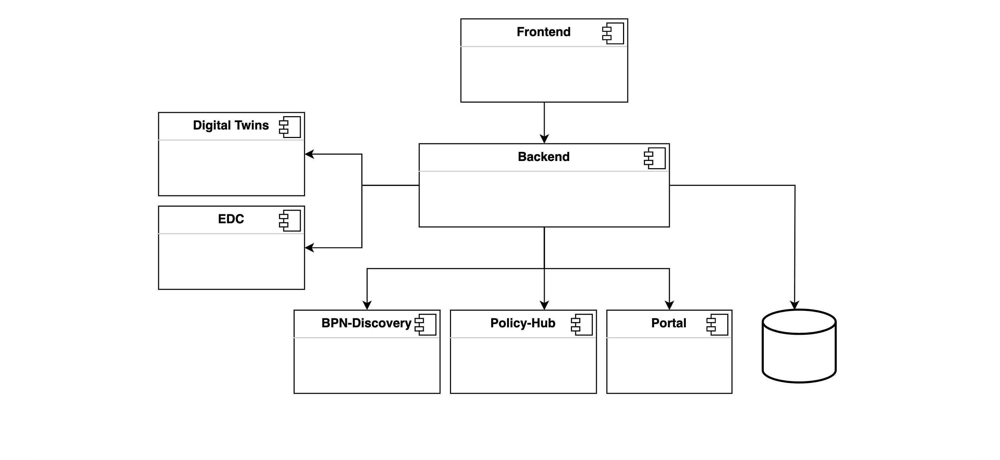
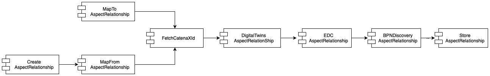
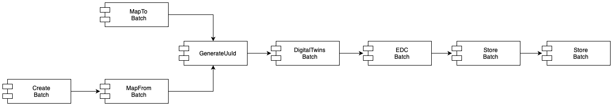
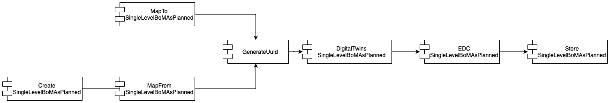
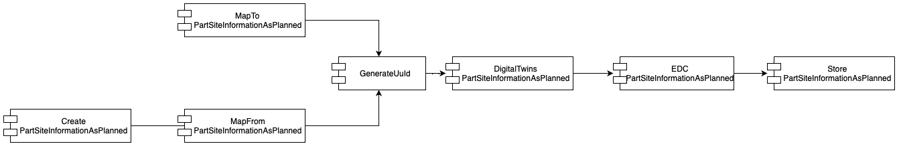

# Simple Data Exchanger

## NOTICE

This work is licensed under the [Apache-2.0](https://www.apache.org/licenses/LICENSE-2.0).

- SPDX-License-Identifier: Apache-2.0
- SPDX-FileCopyrightText: 2021,2022,2023 T-Systems International GmbH
- SPDX-FileCopyrightText: 2022,2023 Contributors to the Eclipse Foundation
- Source URL: https://github.com/eclipse-tractusx/managed-simple-data-exchanger-frontend

## Table of contents

- [Simple Data Exchanger](#simple-data-exchanger)
- [Introduction and Goals](#introduction-and-goals)
    - [Requirements Overview](#requirements-overview)
    - [Quality Goals](#quality-goals)
    - [Stakeholders](#stakeholders)
- [Architecture Constraints](#architecture-constraints)
- [System Scope and Context](#system-scope-and-context)
    - [Business Context](#business-context)
    - [Technical Context](#technical-context)
- [Solution Strategy](#solution-strategy)
- [Building Block View](#building-block-view)
    - [Interfaces or Apis](#interfaces-or-apis)
    - [Data processing pipelines](#data-processing-pipelines)
- [Deployment View](#deployment-view)
- [Quality Requirements](#quality-requirements)
- [Glossary](#glossary)

# Simple Data Exchanger

## **Introduction and Goals**

### **Requirements Overview**
 

#### **What is SDE?**

In order to allow Data Providers and Data Consumers to easily participate in relevant Use Cases, a service for low-effort data sharing was needed. The service would add a convenience layer around already established CX components, such as EDC and Digital Twin Registry, simplifying their use.
- SDE is short for **S**imple **D**ata **E**xchanger.
- It is a standalone service which can be self-hosted.
- It enables companies to provide their data in the Catena-X network via an EDC.
- Data is uploaded via CSV-files/Manual Entry/Json format.
- The SDE registers the data in the Digital Twin Registry and makes it accessible via an EDC.
- It is validate the CX network company BPN's to allow data as consumer. 
- SDE also act as a Data Consumer.
- It is show the data offers from data provider.

 

#### **Essential Features**

- Compliance with Catena-X Guidelines.
- Parsing of CSV file/manual Entry for Parts and Relationships.
- Integration with Digital Twin registry.
- Utilization of EDC to provide data and consume data.
- Integration with Portal Service to validate BPN's Numbers as well as get the Connectors URL details of companies.
- Integration Keycloak authentication for security.
- Integration BPN Discovery service to support decentralized DTR.

 

#### **Further key information**

- SDE is an **Open-Source reference implementation** allowing to provide & consume data within the Catena-X network using the Eclipse Data Space (EDC) Connector & Digital Twin Registry.
- It is **not** "the only" way to exchange data with the Catena-X network. It is meant only as one consistent example how EDC + Digital Twin registry APIs can be used end-to-end. Other applications may be developed and co-exist that fulfill a similar purpose.
- Is is **not** meant to fulfill "functional completeness" in the sense of satisfying each and every user group or use case.
- It primary targets companies with low IT skills, therefore it is a Simple Data Exchanger.

 

### **Quality Goals**

The following table describes the key quality objectives of SDE.

| Quality Goal                         | Motivation/description                                                                                                                               |
|--------------------------------------|------------------------------------------------------------------------------------------------------------------------------------------------------|
| Integration into Catena-X Network    | The SDE is meant to help companies bringing their data to Catena-X. One key goal is to be integrated into the Catena-X network with all its services |
| CSV input files with clear structure | The input files used by SDE should be easy to understand by every company                                                                            |
| Lightweight service                  | The service should be as lightweight as possible to enable easy deployment.                                                                          |
| Docker Container                     | SDE should be deployable via Docker to make deployment as easy as possible                                                                           |
| Integrate EDC in Deployment          | Make SDE an all-in-one solution                                                                                                                      |

The quality scenarios detail these goals and serve to evaluate their achievement.

 

### **Stakeholders**

The following table illustrates the stakeholders of SDE and their respective intentions.

| Who?                               	| Matters and concern                                                                                                            	|
|------------------------------------	|--------------------------------------------------------------------------------------------------------------------------------	|
| Catena-X data providers architects 	| - Get an impression on how data provisioning could look like in Catena-X - Have a reference implementation                  	|
| Larger OEMs / Tiers                	| - Want to use this implementation in their data pipelines                                                                      	|
| SMEs                               	| - Need a solution to provide data into the Catena-X network - CSV makes it easy to integrate the service into own workflows 	|
| Use Case Traceability              	| - What to test their data - Need a service to ingest data into Catena-X network                                             	|

 

## **Architecture Constraints**

| Constraint                            	| Background and / or motivation                                                                                                      	|
|---------------------------------------	|-------------------------------------------------------------------------------------------------------------------------------------	|
| Usage of EDC                          	| Mandatory in Catena-X to ensure data sovereignty for participating companies                                                        	|
| Deployment via helm in  Kubernetes 	| The deployment is done in a Catena.X environment. To do so, the SDE must be able to run in a Kubernetes environment via Helm Charts 	|
| Catena-X Digital Twin Registry        	| Mandatory in Catena-X, decentral lookup for all digital twins        |
| Catena-X BPN-Discovery                    | Mandatory in Catena-X, Push key for lookup all digital twins.                                   	|

 

## **System Scope and Context**

### **Business Context**

| Business / Technical 	 | Name                           	   | Interface 	|
|------------------------|------------------------------------|-----------	|
| Business             	 | User via Webapp to upload file 	   | Webapp    	|
| Technical            	 | Digital twin registry          	   | Https     	|
| Technical            	 | Portal Service         	           | Https      |
| Technical            	 | BPN Discovery                   	   | Https      |

 

### **Technical Context**

| Name                                     	| Interface      	|
|------------------------------------------	|----------------	|
| EDC connector for external communication 	| EDC/IDS        	|
| Digital twin registry                    	| HTTPs          	|
| Portal Service                        	| HTTPs          	|
| BPN Discovery                         	| HTTPs          	|
| File Upload (CSV)                        	| HTTPs endpoint 	|

 

## **Solution Strategy**

| Quality Goal                         	| Matching approaches in the solution                                                 	|
|--------------------------------------	|-------------------------------------------------------------------------------------	|
| Integration into Catena-X Network    	| Usage of Catena-X services like the Digital Twin Registry and EDC for data exchange 	|
| CSV input files with clear structure 	| Definition of a CSV file, which can be used for data upload                         	|
| Lightweight service                  	|                                                                                     	|
| Docker Container                     	|                                                                                     	|
| Integrate EDC in deployment          	|                                                                                     	|

 
The SDE is divided into two components: Frontend and Backend. The frontend is very minimal with only the basic functionality. 
The backend is implemented in Java to ensure wide adoption following the Clean architecture principles.

   

 

## **Building Block View**

SDE is a classic single tenant Web application that communicates with the backend api through REST.

Its having 2 components:

1. Frontend in React;
2. Backend in Java with SpringBoot;

    

| SubSystem     	| Short description                                                                                               	 |
|---------------	|-------------------------------------------------------------------------------------------------------------------|
| Frontend      	| Provide a friendly interface to the user to support the csv file upload or sub model creation                   	 |
| Backend       	| Service that contains the REST api to support the Frontend and the execution pipeline to process the sub models 	 |
| EDC           	| Eclipse data connector acting as data provider and data consumer to retrieve sub model's details                	 |
| Digital Twins 	| Rest API that allows to register a sub model                                                                    	 |
| Portal           | Rest API that allows to get validate companies BPN's and get list of companies connector URL                       |
| BPN Discovery 	| Rest API that allows to push and search Key value for DT shell lookup details.                                     |

 

### **Interfaces or Apis**

SDE does not expose interfaces for other applications or components to call (i.e. no "external interfaces").

SDE does call interfaces of other components as by the picture above (i.e. of EDC, Digital Twin Registry, Portal).

There is a web interface between frontend and backend.  

Detailed API specs available under:

[https://github.com/catenax-ng/tx-managed-simple-data-exchanger-backend/blob/main/modules/sde-core/src/main/resources/sde-open-api.yml](https://github.com/catenax-ng/tx-managed-simple-data-exchanger-backend/blob/main/modules/sde-core/src/main/resources/sde-open-api.yml)

[https://github.com/catenax-ng/tx-managed-simple-data-exchanger-backend/tree/main#restful-apis-of-dft-simple-data-exchanger](https://github.com/catenax-ng/tx-managed-simple-data-exchanger-backend/tree/main#restful-apis-of-dft-simple-data-exchanger)

Backend API Swagger-ui : [https://dft-api.int.demo.catena-x.net/api/swagger-ui/index.html](https://dft-api.int.demo.catena-x.net/api/swagger-ui/index.html)

 

### **Data processing pipelines**

#### **Serial Part**

    

| Module               	| Description                                                                                                                                                                                                                                                                                                                                                                                                                                                                                                             	| Execution order 	|
|----------------------	|-------------------------------------------------------------------------------------------------------------------------------------------------------------------------------------------------------------------------------------------------------------------------------------------------------------------------------------------------------------------------------------------------------------------------------------------------------------------------------------------------------------------------	|-----------------	|
| CreateAspect         	| Used when Serial Part Typization is created on the frontend using the table or submit the json request with the content.  It set the row position and process id in each item.                                                                                                                                                                                                                                                                                                                                    	| 0               	|
| MapToAspect          	| Convert the string that came on the uploaded CSV file to an Aspect dto.  It also validate the mandatory fields are fulfilled.                                                                                                                                                                                                                                                                                                                                                                                     	| 1               	|
| MapFromAspectRequest 	| Convert from the AspectRequest object to an Aspect dto. It also validate the mandatory fields are fulfilled.                                                                                                                                                                                                                                                                                                                                                                                                         	| 1               	|
| GenerateUUId         	| Check if Aspect have a non null and non blank uuid. If not it will generate one UUID with the defined prefix "urn:uuid:".                                                                                                                                                                                                                                                                                                                                                                                               	| 2               	|
| DigitalTwinsAspect   	| Do the interface in the Digital Twins registry.  - It will lookup for shells and if no shell is found it will create one; - If a single shell exists for the given key it will use that shell; - If multiple shell are found it will through an exception; - It will lookup for sub models. If no sub model is found it will create one; - If a sub model is found it will set the Aspect with that sub model id;   Please note that a shell can only have two sub models at the time being. 	| 3               	|
| EDCAspect            	| Do the interface in the Eclipse Data Connector (EDC)  - It will lookup for a previous asset registry; - If no asset registry is found it will create an asset with a applied OR default policy and contract definition;                                                                                                                                                                                                                                                                                                               	| 4               	|
| BPNDiscovery          	| Push Key of Aspect asset into the BPN Discovery for DDTR lookup.                                                                                                                                                                                                                                                                                                                                                                                                                                                            	| 5               	|
| StoreAspect          	| Store the Aspect in the SDE database.                                                                                                                                                                                                                                                                                                                                                                                                                                                                                   	| 6               	|

 

#### **Single Level BoM As Built**

    

| Module                           	| Description                                                                                                                                                                                                                                                                                                                                                                                                                                                                                                                      	| Execution order 	|
|----------------------------------	|----------------------------------------------------------------------------------------------------------------------------------------------------------------------------------------------------------------------------------------------------------------------------------------------------------------------------------------------------------------------------------------------------------------------------------------------------------------------------------------------------------------------------------	|-----------------	|
| CreateAspectRelationship         	| Used when assembly part relationship is created on the frontend using the table or submit the json request with the content.  It set the row position and process id in each item.                                                                                                                                                                                                                                                                                                                                         	| 0               	|
| MapToAspectRelationship          	| Convert the string that came on the uploaded CSV file to an Aspect Relationship dto.  It also validate the mandatory fields are fulfilled.                                                                                                                                                                                                                                                                                                                                                                                 	| 1               	|
| MapFromAspectRelationshipRequest 	| Convert from the AspectRelationshipRequest object to an Aspect Relationship dto.  It also validate the mandatory fields are fulfilled.                                                                                                                                                                                                                                                                                                                                                                                     	| 1               	|
| FetchCatenaXId                   	| Check if Aspect Relationship have a non null and non blank parent uuid and child uuid.   - Lookup call with Digital Twins for both parent and child aspect else parent or child not found will be thrown; - If parent and child are found both uuid will be set on the Aspect Relationship; - If parent or child are not found an exception will be thrown;                                                                                                                                                                                                                                                                          	| 2               	|
| DigitalTwinsAspectRelationship   	| Do the interface in the Digital Twins registry.  - It will lookup for shells and if no shell is found it will create one; - If a single shell exists for the given key it will use that shell; - If multiple shell are found it will through an exception; - It will lookup for sub models. If no sub model is found it will create one; - If a sub model is found it will set the Aspect Relationship with that sub model id;  Please note that a shell can only have two sub models at the time being. 	| 3               	|
| EDCAspectRelationship            	| Do the interface in the Eclipse Data Connector (EDC)  - It will lookup for a previous asset registry; - If no asset registry is found it will create an asset plus a default policy and contract definition;                                                                                                                                                                                                                                                                                                                        	| 4               	|
| BPNDiscovery          	| Push Key of Aspect asset into the BPN Discovery for DDTR lookup.                                                                                                                                                                                                                                                                                                                                                                                                                                                                               	| 5               	|
| StoreAspectRelationship          	| Store the Aspect Relationship in the SDE database.                                                                                                                                                                                                                                                                                                                                                                                                                                                                               	| 6               	|

 

#### **Batch**

    

| Module              	| Description                                                                                                                                                                                                                                                                                                                                                                                                                                                                                                        	| Execution order 	|
|---------------------	|--------------------------------------------------------------------------------------------------------------------------------------------------------------------------------------------------------------------------------------------------------------------------------------------------------------------------------------------------------------------------------------------------------------------------------------------------------------------------------------------------------------------	|-----------------	|
| CreateBatch         	| Used when Batch upload is created on the frontend using the table or submit the json request with the content.  It set the row position and process id in each item.                                                                                                                                                                                                                                                                                                                                         	| 0               	|
| MapToBatch          	| Convert the string that came on the uploaded CSV file to an Batch dto.  It also validate the mandatory fields are fulfilled.                                                                                                                                                                                                                                                                                                                                                                                 	| 1               	|
| MapFromBatchRequest 	| Convert from the BatchRequest object to an Batch dto.  It also validate the mandatory fields are fulfilled.                                                                                                                                                                                                                                                                                                                                                                                                  	| 1               	|
| GenerateUUId        	| Check if Batch have a non null and non blank uuid. If not it will generate one UUID with the defined prefix "urn:uuid:".                                                                                                                                                                                                                                                                                                                                                                                           	| 2               	|
| DigitalTwinsAspect  	| Do the interface in the Digital Twins registry.  - It will lookup for shells and if no shell is found it will create one; - If a single shell exists for the given key it will use that shell; - If multiple shell are found it will through an exception; - It will lookup for sub models. If no sub model is found it will create one; - If a sub model is found it will set the Batch with that sub model id;  Please note that a shell can only have two sub models at the time being. 	| 3               	|
| EDCBatch            	| Do the interface in the Eclipse Data Connector (EDC)  - It will lookup for a previous registry; - If no registry is found it will create an asset plus a default policy and contract definition;                                                                                                                                                                                                                                                                                                          	| 4               	|
| BPNDiscovery          	| Push Key of Aspect asset into the BPN Discovery for DDTR lookup.                                                                                                                                                                                                                                                                                                                                                                                                                                                                               	| 5               	|
| StoreBatch          	| Store the Batch in the SDE database.                                                                                                                                                                                                                                                                                                                                                                                                                                                                               	| 6               	|

 

#### **BoM As-Planned - PartAsPlanned**

    

| Module                      	| Description                                                                                                                                                                                                                                                                                                                                                                                                                                                                                                                            	| Execution order 	|
|-----------------------------	|----------------------------------------------------------------------------------------------------------------------------------------------------------------------------------------------------------------------------------------------------------------------------------------------------------------------------------------------------------------------------------------------------------------------------------------------------------------------------------------------------------------------------------------	|-----------------	|
| CreatePartAsPlanned         	| Used when Part As Planned is created on the frontend using the table or submit the json request with the content.  It set the row position and process id in each item.                                                                                                                                                                                                                                                                                                                                                          	| 0               	|
| MapToPartAsPlanned          	| Convert the string that came on the uploaded CSV file to an PartAsPlanned dto.  It also validate the mandatory fields are fulfilled.                                                                                                                                                                                                                                                                                                                                                                                             	| 1               	|
| MapFromPartAsPlannedRequest 	| Convert from the PartAsPlannedRequest object to an PartAsPlanned dto.  It also validate the mandatory fields are fulfilled.                                                                                                                                                                                                                                                                                                                                                                                                      	| 1               	|
| GenerateUUId                	| Check if PartAsPlanned have a non null and non blank uuid. If not it will generate one UUID with the  defined prefix "urn:uuid:".                                                                                                                                                                                                                                                                                                                                                                                                   	| 2               	|
| DigitalTwinsPartAsPlanned   	| Do the interface in the Digital Twins registry.   - It will lookup for shells and if no shell is found it will create one;  - If a single shell exists for the given key it will use that shell;  - If multiple shell are found it will throw an exception;  - It will lookup for sub models.   - If no sub model is found it will create one;  - If a sub model is found it will set the PartAsPlanned with that sub model id;  Please note that a shell can only have two sub models at the time being. 	| 3               	|
| EDCPartAsPlanned            	| Do the interface in the Eclipse Data Connector (EDC)   - It will lookup for a previous asset registry;  - If no asset registry is found it will create an asset with a applied OR default policy and contract definition;                                                                                                                                                                                                                                                                                                                            	| 4               	|
| StorePartAsPlanned          	| Store the PartAsPlanned in the SDE database.                                                                                                                                                                                                                                                                                                                                                                                                                                                                                           	| 5               	|
 

#### **BoM As-Planned - SingleLevelBoMAsPlanned**
    

| Module                                	| Description                                                                                                                                                                                                                                                                                                                                                                                                                                                                                                                                    	| Execution order 	|
|---------------------------------------	|-----------------------------------------------------------------------------------------------------------------------------------------------------------------------------------------------------------------------------------------------------------------------------------------------------------------------------------------------------------------------------------------------------------------------------------------------------------------------------------------------------------------------------------------------	|-----------------	|
| CreateSingleLevelBoMAsPlanned         	| Used when Single Level BoM As - Planned is created on the frontend using the table or submit the  json request with the content. It set the row position and process id in each item.                                                                                                                                                                                                                                                                                                                                                    	| 0               	|
| MapToSingleLevelBoMAsPlanned          	| Convert the string that came on the uploaded CSV file to an SingleLevelBoMAsPlanned dto.  It also validate the mandatory fields are fulfilled.                                                                                                                                                                                                                                                                                                                                                                                           	| 1               	|
| MapFromSingleLevelBoMAsPlannedRequest 	| Convert from the SingleLevelBoMAsPlanned Request object to an SingleLevelBoMAsPlanned dto.  It also validate the mandatory fields are fulfilled.                                                                                                                                                                                                                                                                                                                                                                                         	| 1               	|
| GenerateUUId                          	| Check if SingleLevelBoMAsPlanned have a non null and non blank uuid.   If not it will generate one UUID with the defined prefix "urn:uuid:".                                                                                                                                                                                                                                                                                                                                                                                             	| 2               	|
| DigitalTwinsSingleLevelBoMAsPlanned   	| Do the interface in the Digital Twins registry.   - It will lookup for shells and if no shell is found it will create one;  - If a single shell exists for the given key it will use that shell;  - If multiple shell are found it will throw an exception;  - It will lookup for sub models. If no sub model is found it will create one;  - If a sub model is found it will set the SingleLevelBoMAsPlanned with that sub model id;  Please note that a shell can only have two sub models at the time being. 	| 3               	|
| EDCSingleLevelBoMAsPlanned            	| Do the interface in the Eclipse Data Connector (EDC)   - It will lookup for a previous asset registry;  - If no asset registry is found it will create an asset with a applied OR default policy and contract definition;                                                                                                                                                                                                                                                                                                                                    	| 4               	|
| StoreSingleLevelBoMAsPlanned          	| Store the SingleLevelBoMAsPlanned in the SDE database.                                                                                                                                                                                                                                                                                                                                                                                                                                                                                         	| 5               	|
 

#### **BoM As-Planned - PartSiteInformationAsPlanned**
    

| Module                                     	| Description                                                                                                                                                                                                                                                                                                                                                                                                                                                                                                                                         	| Execution order 	|
|--------------------------------------------	|-----------------------------------------------------------------------------------------------------------------------------------------------------------------------------------------------------------------------------------------------------------------------------------------------------------------------------------------------------------------------------------------------------------------------------------------------------------------------------------------------------------------------------------------------------	|-----------------	|
| CreatePartSiteInformationAsPlanned         	| Used when Single Level BoM As - Planned is created on the frontend using the table or submit the  json request with the content. It sets the row position and process id in each item.                                                                                                                                                                                                                                                                                                                                                        	| 0               	|
| MapToPartSiteInformationAsPlanned          	| Convert the string that came on the uploaded CSV file to PartSiteInformationAsPlanned dto.  It also validate the mandatory fields are fulfilled.                                                                                                                                                                                                                                                                                                                                                                                              	| 1               	|
| MapFromPartSiteInformationAsPlannedRequest 	| Convert from the PartSiteInformationAsPlannedRequest object to PartSiteInformationAsPlanned dto.  It also validate the mandatory fields are fulfilled.                                                                                                                                                                                                                                                                                                                                                                                        	| 1               	|
| GenerateUUId                               	| Check if PartSiteInformationAsPlanned have a non null and non blank uuid.   If not it will generate one UUID with the defined prefix "urn:uuid:".                                                                                                                                                                                                                                                                                                                                                                                             	| 2               	|
| DigitalTwinsPartSiteInformationAsPlanned   	| Do the interface in the Digital Twins registry.   - It will lookup for shells and if no shell is found it will create one;  - If a single shell exists for the given key it will use that shell;  - If multiple shell are found it will throw an exception;  - It will lookup for sub models.   - If no sub model is found it will create one;  - If a sub model is found it will set the PartSiteInformationAsPlanned with that sub model id;  Please note that a shell can only have two sub models at the time being. 	| 3               	|
| EDCPartSiteInformationAsPlanned            	| Do the interface in the Eclipse Data Connector (EDC)   - It will lookup for a previous asset registry;  - If no registry is found it will create an asset with a applied OR default policy and contract definition;                                                                                                                                                                                                                                                                                                                                         	| 4               	|
| StorePartSiteInformationAsPlanned          	| Store the PartSiteInformationAsPlanned in the SDE database.                                                                                                                                                                                                                                                                                                                                                                                                                                                                                         	| 5               	|
 

#### **BoM As-Built - SingleLevelUsageAsBuilt**
    

| Module                                     	      | Description                                                                                                                                                                                                                                                                                                                                                                                                                                                                                                                                         	                                                                                                            | Execution order 	|
|---------------------------------------------------|------------------------------------------------------------------------------------------------------------------------------------------------------------------------------------------------------------------------------------------------------------------------------------------------------------------------------------------------------------------------------------------------------------------------------------------------------------------------------------------------------------------------------------------------------------------------------------------------------------------------------------------------------------------|-----------------	|
| CreateSingleLevelUsageAsBuilt         	           | Used when Single Level BoM As - Built is created on the frontend using the table or submit the  json request with the content. It sets the row position and process id in each item.                                                                                                                                                                                                                                                                                                                                                        	                                                                                                              | 0               	|
| MapToSingleLevelUsageAsBuilt          	           | Convert the string that came on the uploaded CSV file to Single Level Usage As Built dto.  It also validate the mandatory fields are fulfilled.                                                                                                                                                                                                                                                                                                                                                                                              	                                                                                                             | 1               	|
| MapFromSingleLevelUsageAsBuiltRequest 	           | Convert from the SingleLevelUsageAsBuiltRequest object to Single Level Usage As Built dto.  It also validate the mandatory fields are fulfilled.                                                                                                                                                                                                                                                                                                                                                                                        	                                                                                                                  | 1               	|
| FetchCatenaXId                                    | Check if Single Level Usage As Built  have a non null and non blank parent uuid and child uuid.    -If parent and child are found both uuid will be set on the Single Level Usage As Built.   -If parent or child are not found an exception will be thrown                                                                                                                                                                                                                                                                                                                                                                                           	 | 2               	|
| DigitalTwinsSingleLevelUsageAsBuilt   	           | Do the interface in the Digital Twins registry.   - It will lookup for shells and if no shell is found it will create one;  - If a single shell exists for the given key it will use that shell;  - If multiple shell are found it will throw an exception;  - It will lookup for sub models. If no sub model is found it will create one;   - If a sub model is found it will set the Single Level Usage As Built  with that sub model id;  Please note that a shell can only have two sub models at the time being. 	                                                                                                                  | 3               	|
| EDCSingleLevelUsageAsBuilt            	           | Do the interface in the Eclipse Data Connector (EDC)   - It will lookup for a previous asset registry;  - If no asset registry is found it will create an asset with a applied OR default policy and contract definition;                                                                                                                                                                                                                                                                                                                                         	                                                                                     | 4               	|
| StoreSingleLevelUsageAsBuilt          	           | Store the Single Level Usage As Built in the SDE database.                                                                                                                                                                                                                                                                                                                                                                                                                                                                                      	                                                                                                                | 5               	|
 

#### **PCF - Product Carbon Footprint**
    

| Module                                     	 | Description                                                                                                                                                                                                                                                                                                                                                                                                                                                                                                                                         	  | Execution order 	 |
|----------------------------------------------|--------------------------------------------------------------------------------------------------------------------------------------------------------------------------------------------------------------------------------------------------------------------------------------------------------------------------------------------------------------------------------------------------------------------------------------------------------------------------------------------------------------------------------------------------------|-------------------|
| CreatePCFAspect         	                    | Used when PCF upload is created on the frontend using the table or submit the  json request with the content. It sets the row position and process id in each item.                                                                                                                                                                                                                                                                                                                                                        	                     | 0                 |
| MapToPCFAspect          	      | Convert the string that came on the uploaded CSV file to PCFAspect dto.  It also validate the mandatory fields are fulfilled.                                                                                                                                                                                                                                                                                                                                                                                              	                     | 1               	 |
| MapFromPCFAspectRequest 	      | Convert from the PCFAspectRequest object to PCFAspect dto.  It also validate the mandatory fields are fulfilled.                                                                                                                                                                                                                                                                                                                                                                                        	                                        | 1               	 |
| GenerateUUId                               | Check if PCF  have a non null and non blank Id. If not it will generate one UUID with the defined prefix "urn:uuid:".                                                                                                                                                                                                                                                                                                                                                                                       	                                          | 2                 |
| DigitalTwinsPCFAspect   	      | Do the interface in the Digital Twins registry.   - It will lookup for shells and if no shell is found it will create one;  - If a single shell exists for the given key it will use that shell;  - If multiple shell are found it will throw an exception;  - It will lookup for sub models. If no sub model is found it will create one;   - If a sub model is found it will set the PCF  with that sub model id;  Please note that a shell can only have two sub models at the time being. 	                                | 3               	 |
| EDCPCFAspect            	      | Do the interface in the Eclipse Data Connector (EDC)   - It will lookup for a previous registry;  - If no registry is found it will create an asset plus a default policy and contract definition;                                                                                                                                                                                                                                                                                                                                         	  | 4               	 |
| BPNDiscovery          	      | Push Key of Aspect asset into the BPN Discovery for DDTR lookup.                                                                                                                                                                                                                                                                                                                                                                                                                                                                                     	 | 5                 |
| StorePCF          	      | Store the PCF Aspect in the SDE database.                                                                                                                                                                                                                                                                                                                                                                                                                                                                                     	                        | 6                 |
 

### **Whitebox Overall System**

#### **App routing**

| Route               	 | Description                                                      	  | Type 	|
|-----------------------|---------------------------------------------------------------------|------	|
| /login                | Keycloak Authentication                                             | Main 	|
 | /logout               | Keycloak logout                                                     |       |
| /                  	  | Home page for use case selection and app overview                   | Main 	|
| /create-data      	   | Create data using a CSV file, table or submit JSON data directly 	  | Sub  	|
| /upload-history       | Upload history table                                             	  | Sub  	|
| /help          	      | Help guide, CSV rules and samples                                   | Sub  	|
| /consume-data     	   | Get list of data offer by selected providers                     	  | Sub  	|
| /contracts-history 	  | Contracts history table                                             | Sub  	|

 

#### **Frontend folder structure**

| Folder name 	  | Description                                            	|
|----------------|--------------------------------------------------------	|
| components  	  | React components                                       	|
| helpers     	  | Constants and configurations                           	|
| models      	  | Interfaces                                             	|
| features       | app features                                            |
| pages       	  | App pages                                              	|
| services    	  | Frontend service classes (ex: SDEService, UserService) 	|
| store       	  | Redux store to manage global state                     	|
| tests       	  | Unit tests                                             	|
| utils       	  | Auxiliary functions (ex: formatDate)                   	|

 

#### **Frontend dependencies**

| Library                    	  | Description                                           	                               | Link                                                     	 |
|-------------------------------|---------------------------------------------------------------------------------------|------------------------------------------------------------|
| axios                      	  | Promise based HTTP Client for the browser and node.js 	                               | https://www.npmjs.com/package/axios                      	 |
| cx-portal-shared-components 	 | Contains the shared UI components that are used to build the Catena-X Portal Frontend | https://www.npmjs.com/package/cx-portal-shared-components	 |
| redux                      	  | State management for react application                  	                             | https://www.npmjs.com/package/redux         	             |
| @reduxjs/toolkit              | React toolkit for state manangement                     	                             | https://www.npmjs.com/package/@reduxjs/toolkit          	     |
| ajv                       	   | Schema validator                                       	                              | https://www.npmjs.com/package/ajv                        |
| @mui/material                 | React components with Google's material design                                        | https://www.npmjs.com/package/@mui/material                   |
| uuid              	           | Used to generate uuid (dynamic table)                   	                             | https://www.npmjs.com/package/uuid              	         |

 

## **Deployment View**

 
In deployment we are using [ArgoCD](https://argo-cd.readthedocs.io/en/stable/) and Helm. The Helm configuration can be found in folder "helm" in respective repositories.

We have 2 applications on ArgoCD , one for frontend and one for backend. Both applications have auto-sync enabled.

 
  

 

## **Quality Requirements**

 

| Tool       	| Description                                                                                                                                                                                                   	|
|------------	|---------------------------------------------------------------------------------------------------------------------------------------------------------------------------------------------------------------	|
| Veracode   	| "Veracode enables you to quickly and cost-effectively scan software for flaws and get actionable source code analysis results."  [Link](https://www.veracode.com)                                                                      	|
| Trivy      	| "Trivy is a simple and comprehensive vulnerability/misconfiguration/secret scanner for containers and other artifacts. Trivy detects vulnerabilities of OS packages and language-specific packages."  [Link](https://aquasecurity.github.io/trivy/v0.34/) 	|
| SonarCloud 	| "SonarCloud's static analysis detects Bugs and Code Smells in your repositories and provides the feedback you need to write better code."  [Link](https://www.sonarsource.com/products/sonarcloud/)                                                            	|
| ESLint     	| "ESLint statically analyzes your code to quickly find problems."  [Link](https://eslint.org)                                                                                                                                     	|
 

## **Glossary**
 

| Term 	| Definition                                                  	|
|------	|-------------------------------------------------------------	|
| SDE  	| Simple Data Exchanger (current name of this application)    	|
| DFT  	| Data Format Transformer (outdated name of this application) 	|
| EDC  	| Eclipse Data Space Connector (Software to exchange data)    	|
| CSV  	| Comma Separated Values (File format for input files)        	|
| JSON 	| JavaScript Object Notation                                  	|
