# Simple Data Exchanger - User Guide

## Table of contents

- [Getting started](#getting-started)
  - [Accessing the app](#accessing-the-app)
    - [Login](#login)
    - [Logout](#logout)
  - [Navigation](#navigation)
    - [Header](#header)
    - [Main navigation](#left-side-menu)
- [Features](#features)
  - [Home](#home)
  - [Provider](#provider)
    - [Create Data](#create-data)
      - [Upload File](#upload-file)
      - [Tabular Entry](#tabular-entry)
        - [Serial Part Typization](#serial-part-typization)
        - [Batch](#batch)
        - [Assembly Part Relationship](#assembly-part-relationship)
        - [Part As Planned](#part-as-planned)
        - [Single Level Bom As Planned](#single-level-bom-as-planned)
        - [Part Site Information As Planned](#part-site-information-as-planned)
        - [Single Level Usage As Built](#single-level-usage-as-built)
      - [JSON Entry](#manual-json-entry)
        - [Serial Part Typization](#serial-part-typization-1)
        - [Batch](#batch-1)
        - [Assembly Part Relationship](#assembly-part-relationship-1)
        - [Part As Planned](#part-as-planned-1)
        - [Single Level Bom As Planned](#single-level-bom-as-planned-1)
        - [Part Site Information As Planned](#part-site-information-as-planned-1)
        - [Single Level Usage As Built](#single-level-usage-as-built-1)
    - [Upload history](#upload-history)
    - [Contracts](#provider-contracts)
    - [Help](#help)
  - [Consumer](#consumer)
    - [Consume Data](#consume-data)
    - [Contracts](#consumer-contracts)

# Getting started

## **Accessing the app**

[SDE](https://dft.int.demo.catena-x.net/) can be accessed via the internet. The recommended browser is Google Chrome. You need to request an account to access it.

### **Login**

 
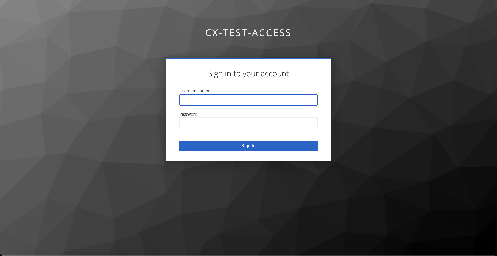

1. Open **S**imple **D**ata **E**xchanger application via the [URL](https://dft.int.demo.catena-x.net/) (recommended browser Google Chrome).
2. Select the organization from the list or search the organization by typing name in input textbox and select the organization from the search results to login to the Simple Data Exchanger application. After selecting the organization from the list, it will redirect to the CatenaX keycloak login page.
3. On Keycloak login page of the selected organization, enter login details i.e. Username or email and Password. Click on Sign In button to login to the Simple Data Exchanger application.

### **Logout**

&nbsp;&nbsp;

1. On the header, click on the user avatar (top right).
2. On the menu click on "Logout".
3. You have signed-out of Simple Data Exchanger application and will be redirected back to the CatenaX signin page.

[-- end of 'getting started' section --]: #

# Navigation

SDE navigation is based on a header and a left-side menu.

## **Header**

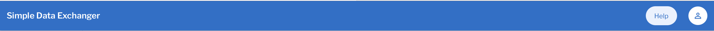

1. On the left side on the header, there is the Simple Data Exchanger header text.
2. On the right side of the header, there is the avatar of the logged-in user. When clicked, there are few information about the logged in user, Logout link and Language switching options will be visible.

## **Left-side menu**

On the left side menu, it is possible to navigate the Simple Data Exchanger application by choosing each the following options / features:

- Home

**Provider**

- Create Data
- Upload History
- Contracts
- Help

**Consumer**

- Consume Data
- Contracts

[-- end of 'navigation' section --]: #

# Features

# **Home**

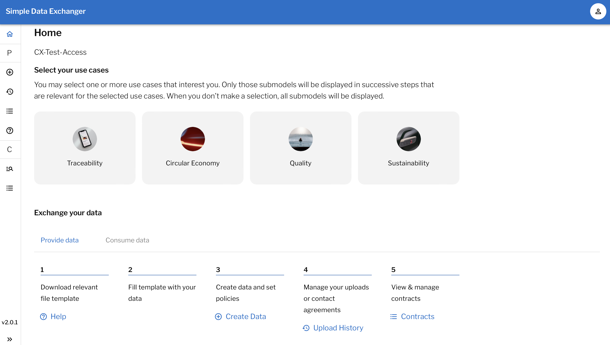

After successful login, user will be redirected to this page by default in the Simple Data Exchanger application. This page contains the overview of the application and use cases selection.

Submodels in the Create Data page will be filtered out based on the usecase selection by user.

# **Provider**

## Create Data

In this page, list of available submodels will be fetched dynamically and we can select any submodel to generate the table or json of that selected submodel based on the schema provided by backend API.

This dynamic UI implementation allows the flexibillity to support and manage multiple submodels in single SDE application and also eliminates the need of hard coded react components for the individual submodels.

There are 3 data providing options in SDE i.e. CSV Upload, Tabular Upload and JSON upload.
The top level Select submodel dropdown will be common for all of 3 tabs i.e. Upload File, Table, JSON. Based on the selected submodel user can download the respective CSV sample and template.

This Create Data page combines all the Data provider options like

- ### Upload File

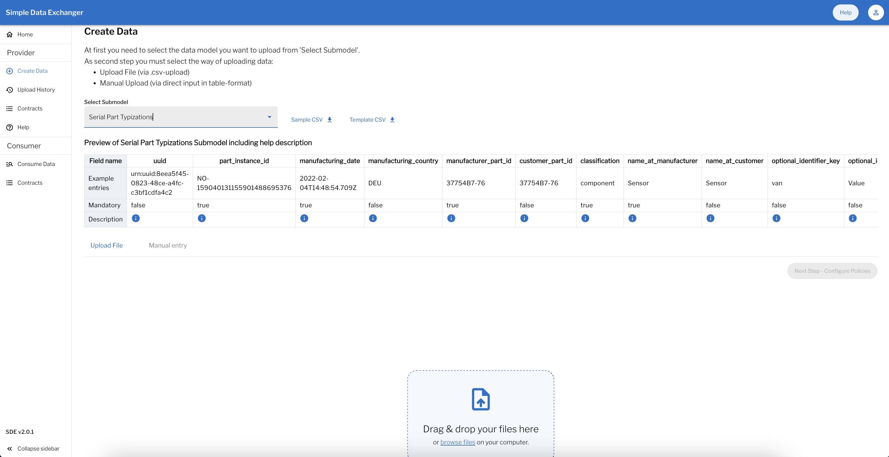

You can upload CSV files of various supported Submodels.

At the moment, Simple Data Exchanger supports data proving options for below list of submodels,

- Serial Part Typization.
- Assembly Part Relationship.
- Batch.
- Part As Planned.
- Single Level Bom As Planned.
- Part Site Information As Planned.

You can click on the button "Choose a file" and select the proper CSV file present in your file system or you can just drag and drop your file in the drop area under upload file component.

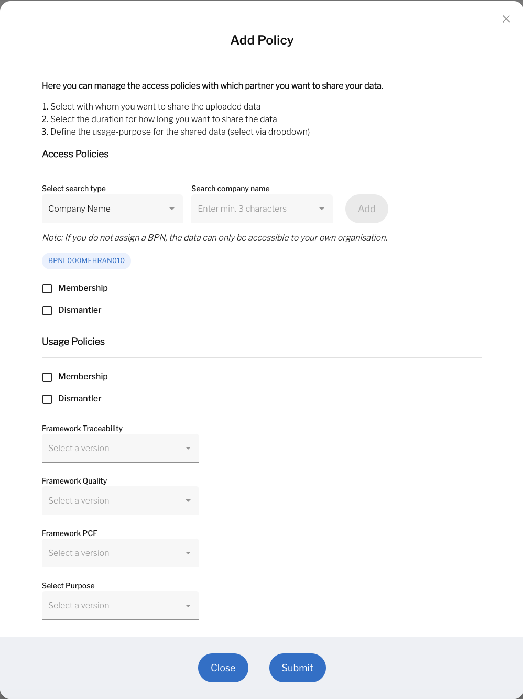

After successful file upload of the supported file format i.e. CSV, the button "NEXT STEP - CONFIGURE POLICIES" will be enabled and after clicking on the same, Policy selection dialog will be shown where we need to configure Access and Usage policy.

Access policy can either be unrestricted or restricted to some Business Partner Numbers. The default company BPN number will be present by default in the list and can not be deleted when we selected Restricted Access Policy option. We can add BPN numbers by entering number and clicking on Add button.

There are 4 types of Usage Policies we can configure namely Duration, Purpose, Role and Custom Restriction.
For every usage policy we have restricted and unrestricted options.
If we selected Restricted option for any usage policy, then we need to enter respective valid free text value.

Once configuring both the policies, we need to click on "SUBMIT" button and wait for upload to finish.
This is the process of creating new data offer through SDE application by uploading CSV file.

- ### Tabular entry

#### Serial Part Typization

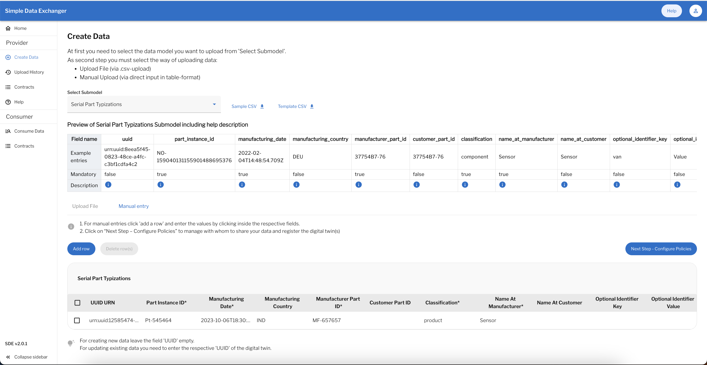

#### Batch

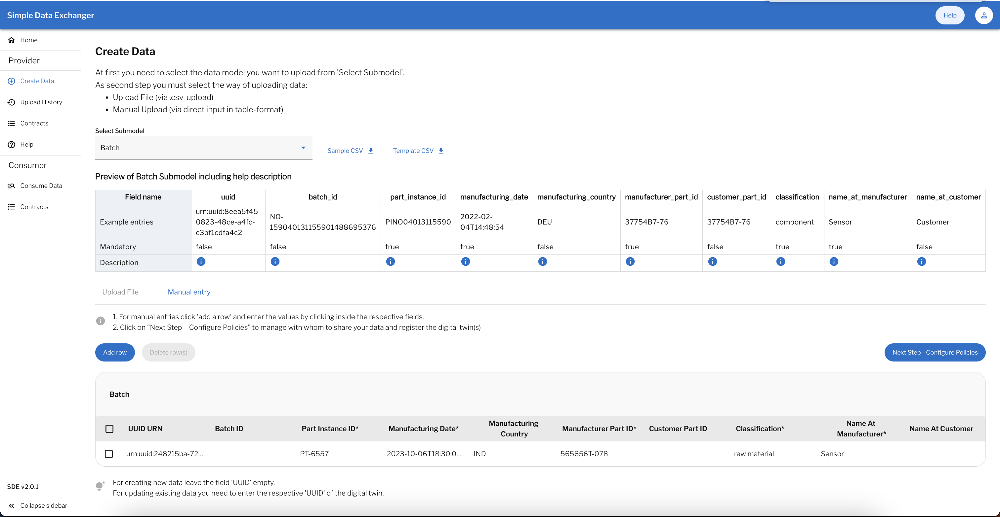

#### Assembly Part Relationship

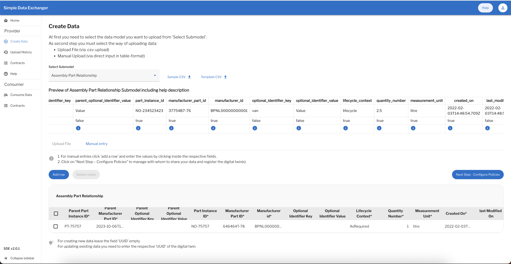

#### Part As Planned

#### Single Level Bom As Planned

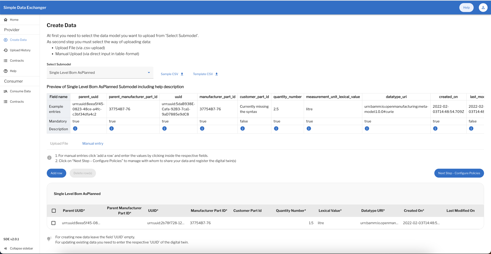

#### Part Site Information As Planned

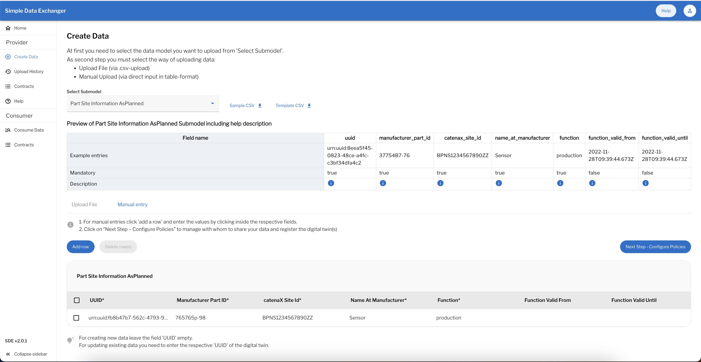

#### Single Level Usage As Built

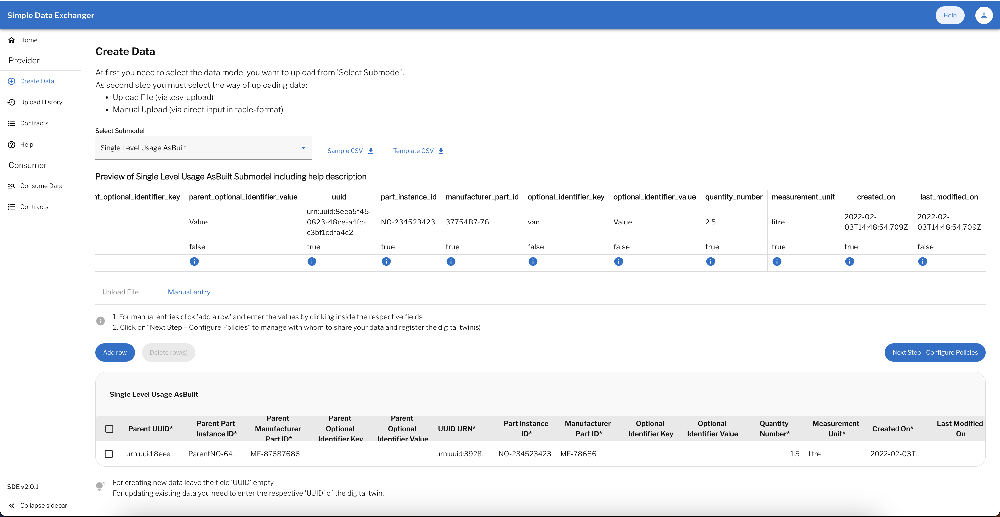

You can add and submit multiple data offers via Tabular entry option for particular submodel by clicking on "Add Row" button to bulk upload the multiple data offers in one go. Once you enter details in all of the required fields for a particular row, you need to select which offers we need to upload by ticking the checkboxes for the respective rows and then we need to click on "NEXT STEP - CONFIGURE POLICIES" button to configure Access and Usage policies and then you need to click on Submit button from policy dialog to uplod the data. You can upload the data for multiple submodels by selecting the respective submodel from the top level Select submodel dropdwon.
We also can delete multiple rows by selecting which rows we want to delete and then click on Delete Row(s) button.

- ### Manual JSON entry

#### Serial Part Typization

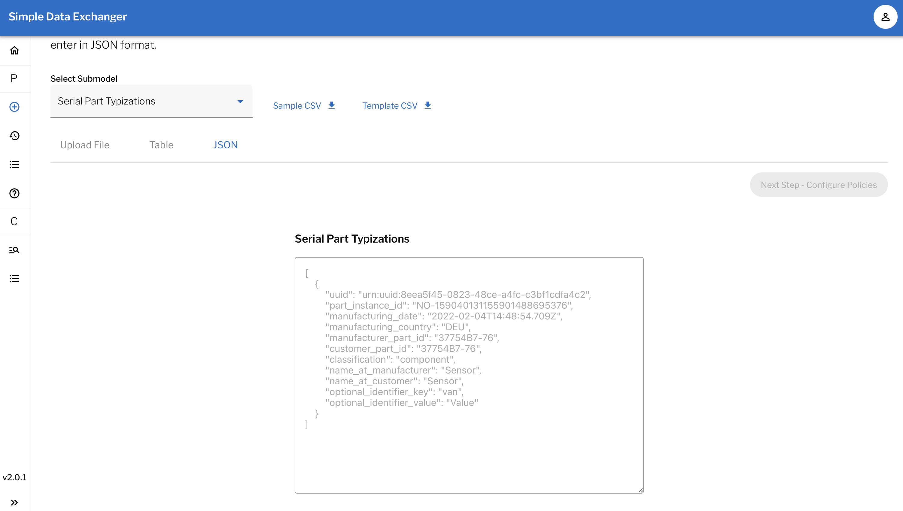

#### Batch

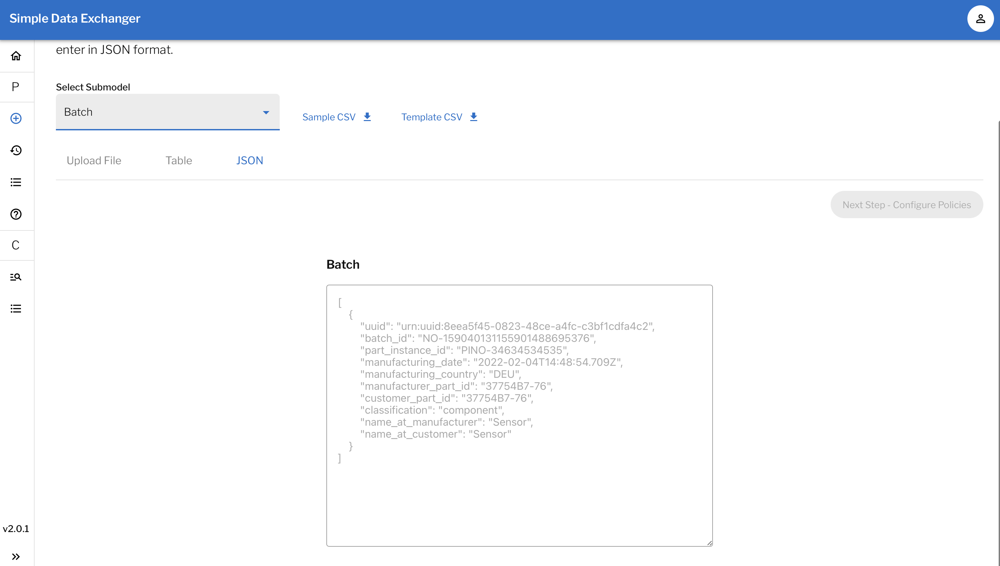

#### Assembly Part Relationship

#### Part As Planned

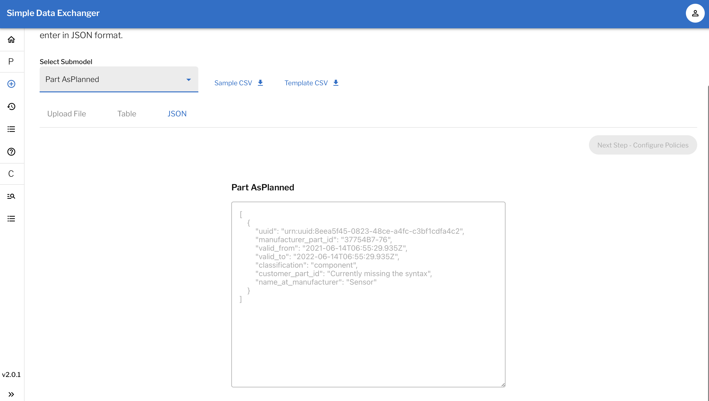

#### Single Level Bom As Planned

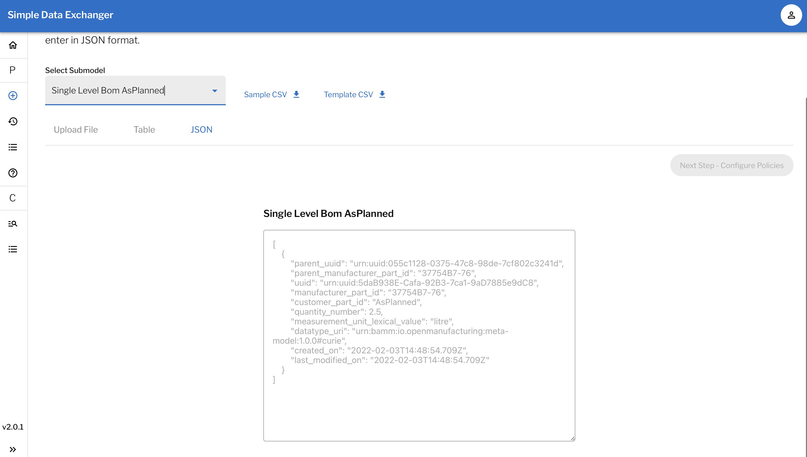

#### Part Site Information As Planned

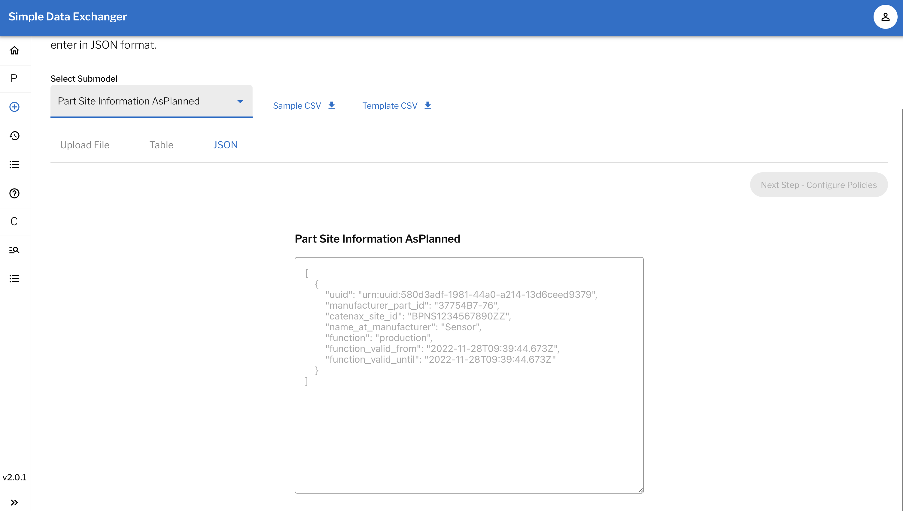

#### Single Level Usage As Built

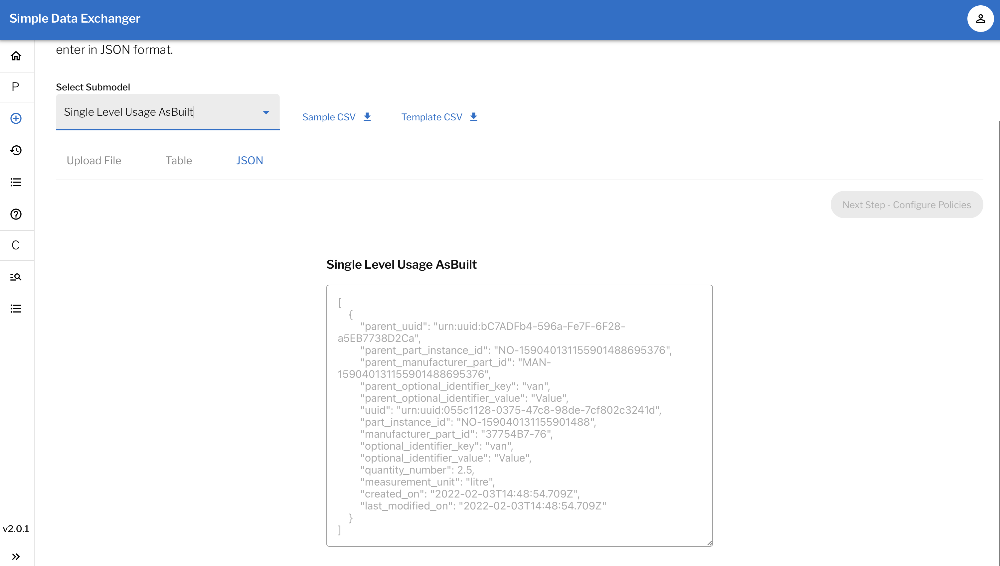

You can also add and submit multiple data offers via Manual JSON entry for various supported submodels by clicking on respective textarea inputbox and entering submodel json schema in form of array or list of multiple objects mentioned in the placeholder for each teaxtarea. The textarea populates the placeholder text which shows the data format alongwith field names which will help to prepare the JSON structure.
Then you need to configure Access and Usage policies by clicking on "NEXT STEP - CONFIGURE POLICIES" button and after successful configuration, click on Submit button from policy dialog to upload bulk data offers at once.

## Upload history

In this menu you can see a table with audit trail logs of the uploaded data offers.

The table has the following columns columns:

- Process Id (id of process);
- CSV Type (ASPECT or ASPECT RELATIONSHIP or BATCH or PARTASPLANNED or SINGLELEVELBOMASPLANNED);
- Number of Created Items (number of Successfully Created items);
- Number of Updated Items (number of Successfully Updated items);
- Number of Deleted Items (number of Successfully Deleted items);
- Number of Failed Items (number of failed items);
- Status (Completed or Completed with warnings or failed);
- Start Date (start date of upload history);
- Duration (duration of uplaod);

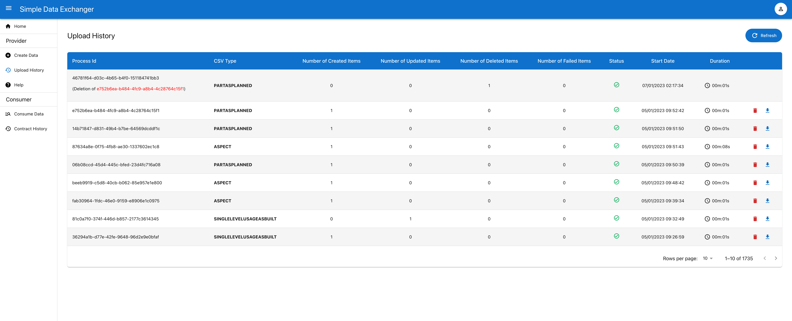

User can delete any data offer or submodel by clicking on the delete action icon present at the end of each row.
The delete icon will only be visible if the Number of Deleted Items count is 0.
After the successful data offer deletion, new row will be generated which shows the new process id and the reference id of the deleted data offer.

Uploaded submodel details can also be downloaded from here as CSV. Only for the deleted entry download option won't be visible.

We can fetch the updated data offers by manually clicking on Refresh button present at top right section of the Upload History page.

## Provider Contracts

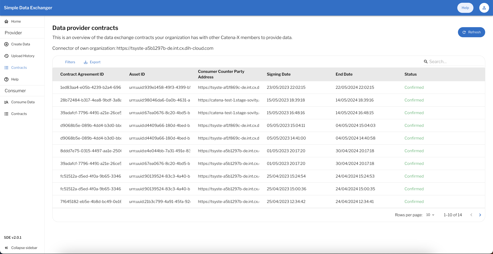

This page contains an overview of the data exchange contracts your organization has with other Catena-X members to provide data.

The table includes below columns:

- Contract Agreement ID (ID of the contract agreement);
- Asset ID (ID of the Asset);
- Consumer Counter Party Address (Counter party address of the contract agreement);
- Signing Date (Signing date of the contract agreement);
- End Date (End date of the contract agreement);
- Status (CONFIRMED or DECLINED or ERROR );

## Help

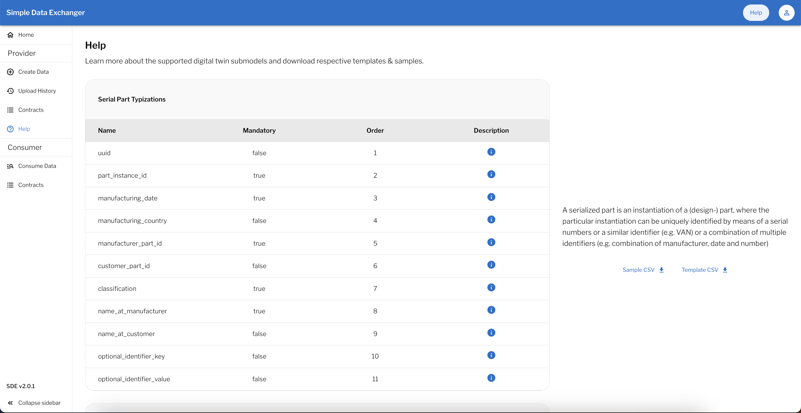

This dynamic help page provides the submodel informations of selected use case in the home page. if no use case selected, it will show all available submodels. User can see the the order of the fields and details of each field by hovering the info icon in each row. User can download the sample csv and csv template for any submodels as well from this page.

# **Consumer**

## Consume Data

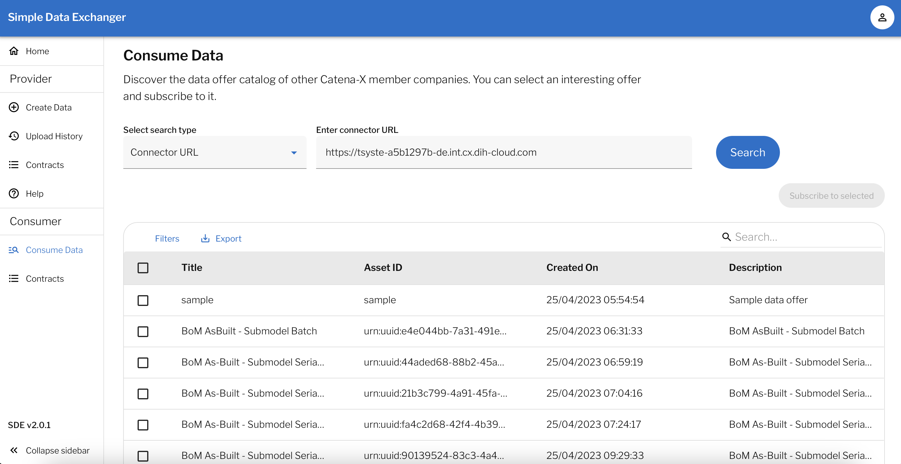

After clicking on the "Consume Data" link in the sidebar navigation menu, user will be redirected to this Consumer view page. On this page, we need to enter the URL of provider connector for which we need to search the already uploaded data or contract offers from provider view. After entering the provider URL, we need to click on "QUERY" button to search or fetch the list of contract offers catalogs. After the successful query operation, the below table will populate list of Contract offers. The table will show the basic meta data of the offers and include the below columns,

- Title (This is title of the data offer or name of the submodel);
- Asset ID (ID of the Asset);
- Created On (Created Date of the offer);
- Publisher (Name of the provider or publisher organization);
- Access Type (RESTRICTED or UNRESTRICTED);
- BPN (Business Partner Number of the company which has access to the data offer);
- Description (Description of the data offer);

The table provides rich rest of convinient features like Filter by, Sorting, Global search, Pagination, Export.

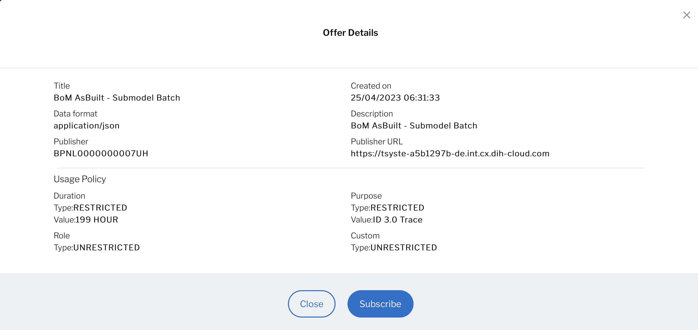

Also we can view and subscribe individual data offer by clicking on the respective row to open the offer details popup.
The offer details dialog will populate all the basic metadata of the selected offer, Access policy and Usage policy details.
You can subscribe the data offer by clicking on "Subscribe" button and accepting the terms.

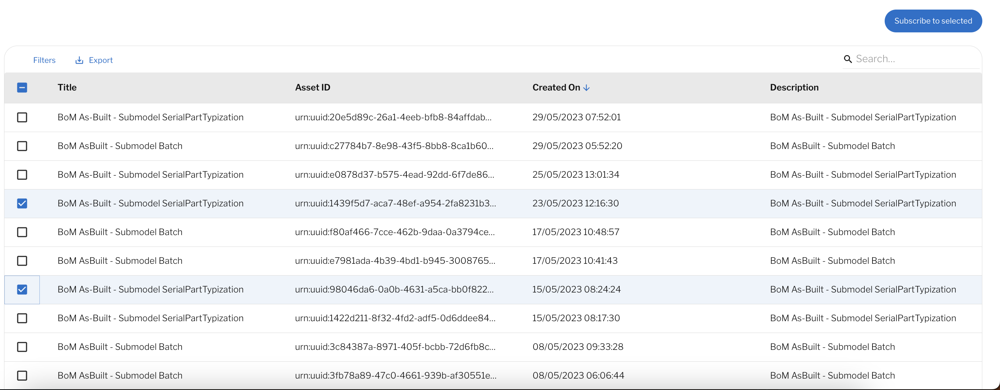

User can also subscribe to multiple data offers at a time by ticking or checking the checkbox in front of the data offers and clicking on the button "Subscribe to Selected" present at top right section of the data offers table.
Please note that, user can only subscribe to multiple data offers if the offers have exact similar usage policies configured.
After clicking on Subscribe button and agreeing to the terms and conditions, the contract agreements establishment process will start for all of the selected data offers for the subscription.

## Consumer Contracts

This page contains an overview of the data exchange contracts your organization has with other Catena-X members to receive & consume data from them.

The table includes below columns:

- Contract Agreement ID (ID of the contract agreement);
- Asset ID (ID of the Asset);
- Provider Counter Party Address (Counter party address of the contract agreement);
- Signing Date (Signing date of the contract agreement);
- End Date (End date of the contract agreement);
- Status (CONFIRMED or DECLINED or ERROR );

[-- end of 'features' section --]: #
