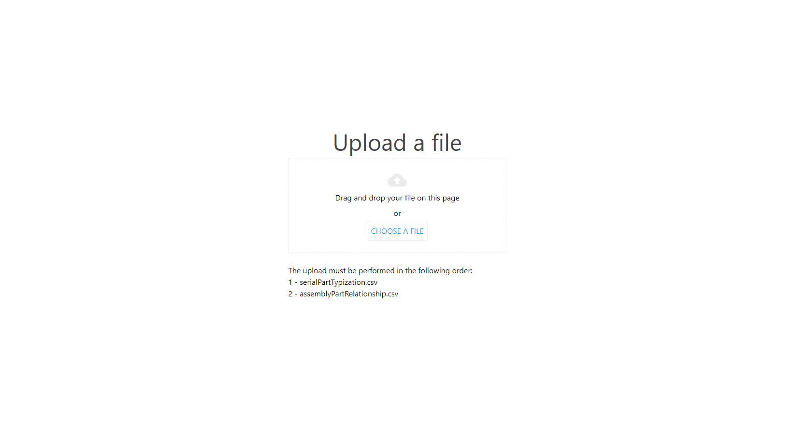

# DFT - User Guide

## Table of contents

- [Getting started](#getting-started)
    - [Accessing the app](#accessing-the-app)
        - [Login](#login)
        - [Sign-out](#sign-out)
    - [Navigation](#navigation)
        - [Header](#header)
        - [Main navigation](#left-side-menu)
- [Features](#features)
    - [Upload file](#upload-file)
    - [Upload history](#upload-history)
    - [Help](#help)

# Getting started

## **Accessing the app**

[DFT](https://dft.int.demo.catena-x.net/) can be accessed via the internet. The recommended browser is Google Chrome. You need to request an account to access it.

### **Login**

1. Open DFT via the [URL](https://dft.int.demo.catena-x.net/) (recommended browser Google Chrome).
2. Enter the user name and password. If the login data is correct, the dashboard of the DFT UI opens. If the information are incorrect, as error message will be displayed.

### **Sign out**

1. On the header, click on the user avatar (top right).
2. On the menu click on "Logout".
3. You have signed-out of DFT.

[-- End of 'Getting started' section --]: # 

# Navigation

DFT navigation is based on a header and a left-side menu.

## **Header**

1. On the left side on the header, there is the DFT logo which redirects the user to the Dashboard (Home) area.
2. On the right side of the header, there is the avatar of the logged-in user. When clicked, it is possible to see the option to Sign-out.

## **Left-side menu**

On the left side menu, it is possible to navigate the DFT application by choosing each the following options / features:

- Upload file
- Upload history
- Help

[-- End of 'Navigation' section --]: # 

# Features

## Upload file

In this menu you can upload your CSV files.
You can click on the button "Choose a file" and select you file or you can just drop your file on this page.
After file selection you need to click on the button "Upload file" and wait for upload to finish.

## Upload history

In this menu you can see a table with upload history.
The table has the following columns columns:
- Process Id (id of process);
- CSV Type (ASPECT or ASPECT_RELATIONSHIP);
- Number of Items (total number of CSV lines);
- Number of Failed Items (number of failed items);
- Start Date (start date of upload history);
- Duration (duration of uplaod);

## Help

In this menu you can see the rules of content (.csv files), the field's name and type (mandatory or not) and you can download the sample or copy the headers for clipboard.

[-- End of 'Features' section --]: # 
