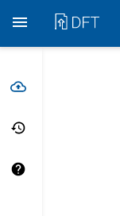
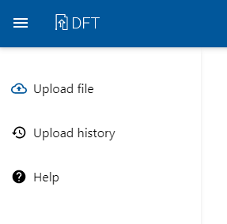
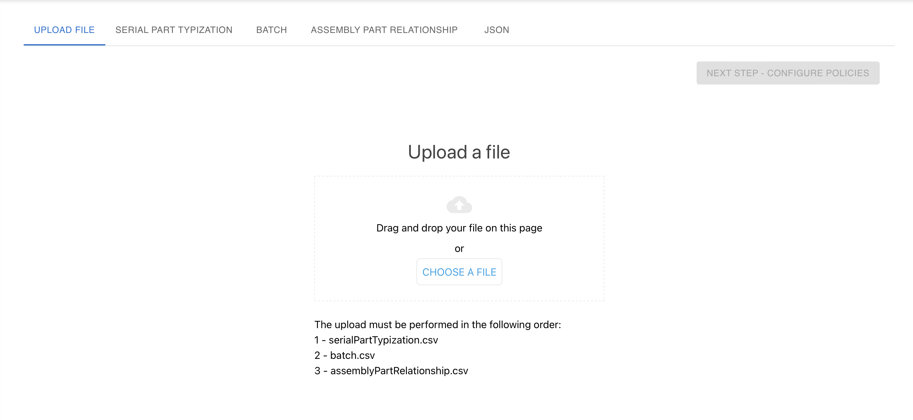
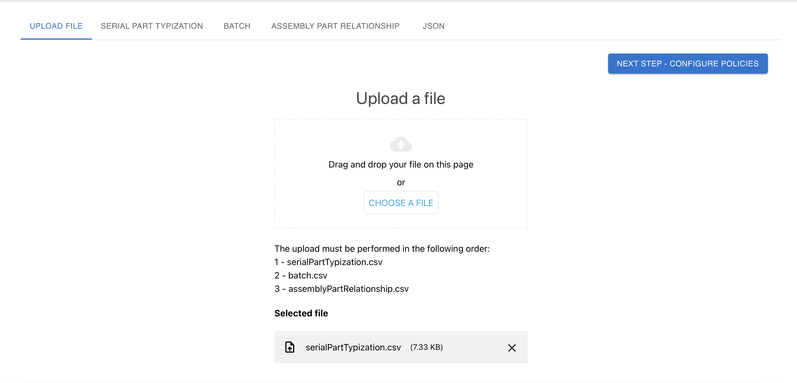
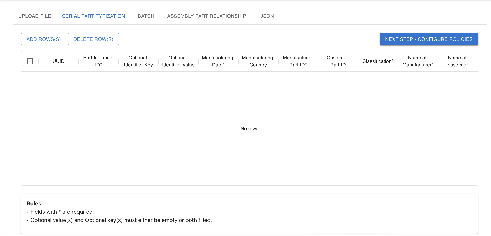
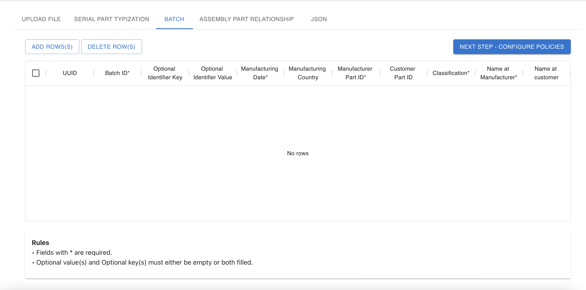
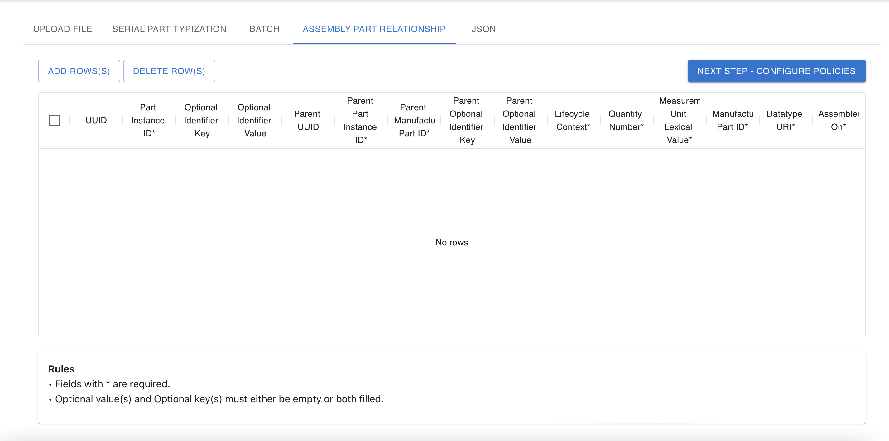
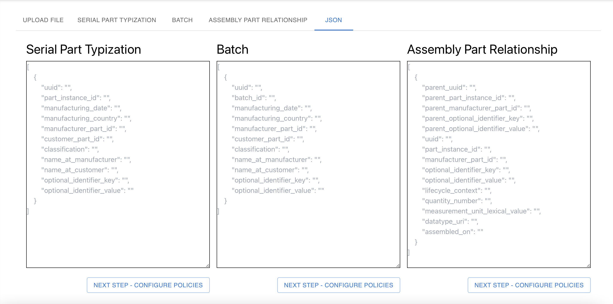
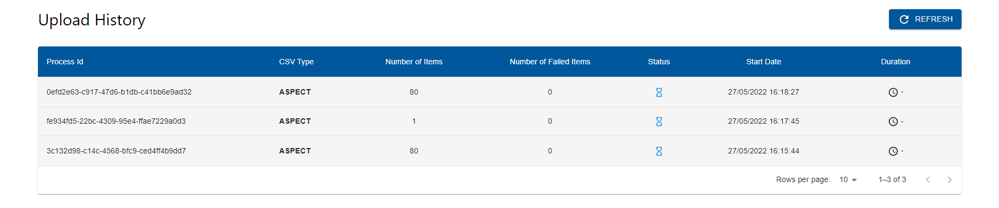

# DFT - User Guide

## Table of contents

- [Getting started](#getting-started)
    - [Accessing the app](#accessing-the-app)
        - [Login](#login)
        - [Sign-out](#sign-out)
    - [Navigation](#navigation)
        - [Header](#header)
        - [Main navigation](#left-side-menu)
- [Features](#features)
    - [Provider](#provider)
        - [Create Data](#create-data)
            - [Upload File](#upload-file)
            - [Tabular Entry](#tabular-entry)
                - [Serial Part Typization](#serial-part-typization)
                - [Batch](#batch)
                - [Assembly Part Relationship](#assembly-part-relationship)
            - [JSON Entry](#manual-json-entry)
        - [Upload history](#upload-history)
        - [Help](#help)
    - [Consumer](#consumer)
        - [Consume Data](#consume-data)
        - [Contract History](#contract-history)

# Getting started

## **Accessing the app**

[DFT](https://dft.int.demo.catena-x.net/) can be accessed via the internet. The recommended browser is Google Chrome. You need to request an account to access it.

### **Login**

1. Open DFT via the [URL](https://dft.int.demo.catena-x.net/) (recommended browser Google Chrome).
2. Select the organization from the list or search the organization by typing name in input textbox and select the organization from the search results to login to the DFT application. After selecting the organization from the list, it will redirect to the CatenaX keycloak login page.
3. On Keycloak login page of the selected organization, enter login details i.e. Username or email and Password. Click on Sign In button to login to the DFT SDE application.

### **Sign out**

&nbsp;&nbsp;

1. On the header, click on the user avatar (top right).
2. On the menu click on "Logout".
3. You have signed-out of DFT and will be redirected back to the CatenaX signin page.

[-- End of 'Getting started' section --]: # 

# Navigation

DFT navigation is based on a header and a left-side menu.

## **Header**

1. On the left side on the header, there is the DFT logo which redirects the user to the Dashboard (Home) area.
2. On the right side of the header, there is the avatar of the logged-in user. When clicked, it is possible to see the option to Sign-out.

## **Left-side menu**

On the left side menu, it is possible to navigate the DFT application by choosing each the following options / features:

**Provider**
- Create Data
- Upload History
- Help

**Consumer**
- Consume Data
- Contract History

[-- End of 'Navigation' section --]: # 

# Features

# **Provider**

## Create Data

After successful login, user will be redirected to this page by default in the DFT application.

This Create Data page combines all the Data provider options like 

- ### Upload File

You can upload CSV files of various supported Submodels.
You can click on the button "Choose a file" and select you file or you can just drop your file on this page.
After successful file selection of the supported file format i.e. CSV, the button "NEXT STEP - CONFIGURE POLICIES" will be enabled and after clicking on the same, Policy selection dialog will be shown where we need to configure Access and Usage policy. Once configuring the same, we need to click on "SUBMIT" button and wait for upload to finish.

- ### Tabular entry

#### Serial Part Typization

#### Batch

#### Assembly Part Relationship

You can add and submit multiple data offers via Tabular entry option for particular submodel by clicking on "Add Row(s)" button and submit the details for all the rows in one go. Once you fill all the required data for a particular row, you need to click on "NEXT STEP - CONFIGURE POLICIES" button to configure Access and Usage policies and then you need to click on Submit button from policy dialog to uplod the data. We can upload the data for SerialPartTypization, Batch and AssemblyPartRelationship submodels by clicking on the respective tabs.

- ### Manual JSON entry

You can also add and submit multiple data offers via Manual JSON entry for various supported submodels by clicking on respective textarea inputbox and entering submodel json schema in form of array or list of multiple objects mentioned in the placeholder for each teaxtarea. Then you need to configure Access and Usage policies by clicking on "NEXT STEP - CONFIGURE POLICIES" button and after successful configuration, click on Submit button from policy dialog to upload bulk data at once.

## Upload history

In this menu you can see a table with upload history.
The table has the following columns columns:
- Process Id (id of process);
- CSV Type (ASPECT or ASPECT_RELATIONSHIP or BATCH);
- Number of Items (total number of CSV lines);
- Number of Failed Items (number of failed items);
- Status (Completed or Completed with warnings or failed);
- Start Date (start date of upload history);
- Duration (duration of uplaod);

## Help

In this menu you can see the rules of content (.csv files), the field's name and type (mandatory or not) and you can download the sample or copy the headers for clipboard.

# **Consumer**

## Consume Data

After clicking on the "Consume Data" link in the sidebar navigation menu, user will be redirected to this Consumer view page. On this page, we need to enter the URL of provider connector for which we need to search the already uploaded data or contract offers from provider view. After entering the provider URL, we need to click on "QUERY" button to search or fetch the list of contract offers catalogs. After the successful query operation, the below table will populate list of Contract offers. The table will show the basic meta data of the offers and include the below columns,
- Title (This is title of the data offer or name of the submodel);
- Asset ID (ID of the Asset);
- Created On (Created Date of the offer);
- Publisher (Name of the provider or publisher organization);
- Access Type (RESTRICTED or UNRESTRICTED);
- BPN (Business Partner Number of the company which has access to the data offer);
- Description (Description of the data offer);

The table provides rich rest of convinient features like Filter by, Sorting, Global search, Pagination, Export.

Also we can view and subscribe individual data offer by clicking on the respective row to open the offer details popup.
The offer details dialog will populate all the basic metadata of the selected offer, Access policy and Usage policy details.
You can subscribe the data offer by clicking on "Subscribe" button and accepting the terms.

User can also subscribe to multiple data offers at a time by ticking or checking the checkbox in front of the data offers and clicking on the button "Subscribe to Selected" present at top right section of the data offers table. 
Please note that, user can only subscribe to multiple data offers if the offers have exact similar usage policies configured.
After clicking on Subscribe button and agreeing to the terms and conditions, the contract agreements establishment process will start for all of the selected data offers for the subscription.

## Contract History

After clicking on the Contract History menu item from the sidebar navigation menu, the contract agreements subscription history information will be retrieved and displayed in the Contract Agreements History table. The user can stay up to date with the latest Contract Agreements by clicking on Refresh button to retrieve the latest contract agreements.
This table also provides rich set of convinient user friendly features such as Filter by, Export, Sort, Search and Pagination.

The table includes below columns:
- Contract Agreement ID (ID of the contract agreement);
- Asset ID (ID of the Asset);
- Counter Party Address (Counter party address of the contract agreement);
- Title (Title of the contract agreement);
- Organization (Name of the organization to which contract agreements associated);
- Signing Date (Signing date of the contract agreement);
- End Date (End date of the contract agreement);
- Status (CONFIRMED or DECLINED or ERROR );

[-- End of 'Features' section --]: # 
